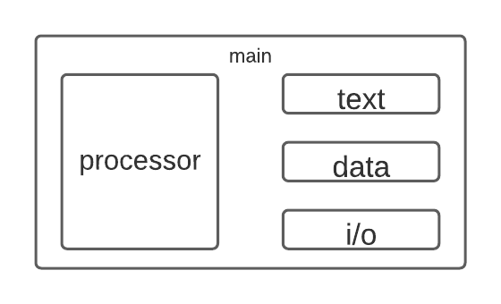

# RISC-V in Verilog
### A Hardware Design Project by David Garcia Gonzalez.

This project follows the concepts in Computer Architecture of the RISC-V ISA explained in the Patterson and Hennessy book. The project tries to create a pipelined processor that includes most of the concepts developed on the book. The synthesis is completely developed in Verilog, while SystemVerilog is used for the testbenches. The end result is a computing system with a processor and both data and instruction memory.

Below is the project folder structure:

## First Steps: Pipeline Stages and Hardware

### Pipeline Stages
This RISC-V implementation consists of five pipeline stages, defined as follows:
- **IF Stage**: in this stage we have the PC register and the instruction memory.
- **ID Stage**: in this stage we have the register file, the branch/jump logic for the pc, the immediate generator, the comparison unit for registers and the control unit.
- **EX Stage**: in this stage we have the ALU.
- **MEM Stage**: in this stage we have the data memory.
- **WB Stage**: in this stage we have the writeback value to the register file (if there is one)

This stages are implemented in the order they appear above.

### PC
The PC register (which contains the program counter, **pc**) has a length of 32 bits. Its enable and reset signals are going to be explained later since they are relevant for branches, jumps and data hazards. The input of the PC is fed by three possible inputs controlled by a signal (**PCSrc**) and selected using a mux. The three inputs are:
- **Sequential**: which is the current pc value, plus 4. This corresponds to a PCSrc value of 00 or 11.(pc <- pc + 4)
- **Immediate**: which is the current pc value, plus an immediate. This immediate is shifted one bit to the left. This corresponds to a PCSrc value of 01. (pc <- pc + 2(imm))
- **Indirect**: which is the value of a register, plus an immediate. This corresponds to a PCSrc value of 10. (pc <- rs + imm)

### Instruction Memory
For all memory, each address position represents a byte. A 32 bit signal consists of four memory locations either in text or data. The instruction memory (mem_text) is a ROM. It has an input address (which is the output of the PC) and it outputs the memory location at that address, and also the three next ones (to form a 32 bit signal).

### Register File
This RISC-V implementation consists of 32 integer registers (x0 - x31) of 32 bits each. The register x0 is a constant value register, which always holds the value 0. The other registers can be modified with an enable signal in the negative edge of the clock. The register file has the following inputs:
- **rs1** and **rs2**: these are the first and second source registers.
- **rd**: this is the destination register.
- **RegWrite**: this enables writing the input value to a register rd.
The register file outputs two 32-bit signals, corresponding to the values of register rs1 and rs2.

### Comparison Unit
In order to reduce the cost of branching, the decision to branch or not branch is taken at the ID stage (previous designs made this decision in the EX stage). This change makes necessary the evaluation of comparisons between registers in the ID stage and it means that the forwarding logic that was first designed for the EX stage needs to be moved to the ID stage. This does not change much of the structure of the forwarding unit, but this will be covered later in its own section. The comparison unit takes the outputs of the two forwarding mux and it compares them, generating a flag that tells the PC mux whether to branch or to continue sequentially. This operations are:
- Branch Equal (000)
- Branch Not Equal (001)
- Branch Less Than (010)
- Branch Less Than Unsigned (011)
- Branch Greater Than (100)
- Branch Greater Than Unsigned (101)

For all these operations, it checks the value of rs1 and compares it to the value of rs2. The comparison flag takes the value of 0 if the condition is False and the value of 1 if the condition is True. The decision of which specific condition to output is determined by a 3 bit selector signal. (Verilog note: you can use `$signed()` to make verilog interpret something as a signed value.)

### Control Unit
The control unit gets three different sections of the instruction and it establishes the value of the control signals depending on the value of those sections. The sections are the opcode (bits 0 through 6), func3 (12 through 14) and func7 (25 through 31). The control signals that are determined are the following:
- **RegWrite**: determines whether a value is written to the register file.
- **MemWrite**: determines whether a value is written to memory.
- **MemRead**: determines whether a valus is read from memory.
- **PCSrc**: determines the source of the next pc value.
- **ALUSrc**: determines the sources of the ALU operation.
- **ALUOp**: determines the operation for the ALU.
- **FlagSel**: determines which flag is used from the comparison unit.
- **MemLen**: determines how long is the data that interacts with memory. (8, 16 or 32 bits)
- **FwdRisk**: determines if there is Data Hazard risk and in which part (source or destination).
- **Branch**: determines if the instruction is a branch.
- **Jump**: determines if the instruction is a jump.
There are more control signals that are determined outside of the scope of the control unit, those will be explained later.

### ALU
The ALU has two inputs, the first one can be either the pc value, 0 or the register value, and the second input can be either the immediate value, 4, or the immediate. The ALU supports the following operations: ADD, SUB, AND, XOR, OR, SLL (Shift Left Logical), SRL (Shift Right Logical), SRA (Shift Right Arithmetic), SLA (Set Less Than) and SLTU (Set Less Than Unsigned).

### Immediate Generator
The immediate value used in instructions depends on the instruction type. Since it is not always encoded the same way in the instruction, we need a module that transforms the instruction into a 32-bit immediate signal. To better understand how the instruction matches a determined immediate value, check the RISC-V documentation on immediate encoding. The verilog model for this processor uses the last seven bits of the instruction to determine the immediate value.

### Data Memory
The data memory contains the memory accessible by the user (data). It is broken into four sections, to be able to implement load and store instructions for bytes (8 bits), half-words (16 bits) and words (32 bits). Each memory section contains 8-bit memory locations. For a particular address i, the first one contains the lower 8 bits of the corresponding word, the second one the next 8 and so on. The control signal MemLen determines in which way is the memory accessed, either in bytes, words or halfwords:
- 000: Loads/Stores of bytes.
- 001: Loads/Stores of half-words.
- 010: Loads/Stores of words.
- 011: Loads of signed bytes.
- 100: Loads of signed half-words.

### Pipeline Registers
Pipeline registers hold useful information about the instruction that would be necessary for the correct implementation of the instruction in later stages of the pipeline. It is usually a combination of values (from registers, memory, etc.) and control signals (that get passed from stage to stage).

## Data Hazards
Data hazards can occur when a current instruction in the pipeline requires the execution of another instruction also in the pipeline. A way in which we deal with data hazards is by using a forwarding unit. The forwarding unit determines if there is a data hazards, and then it takes the result still in the pipeline and transfers it directly to the current instruction.

To better understand how to implement the forwarding logic, we classify instructions depending on the forwarding risk they have. An instruction has a forwarding risk in rd if it writes values to memory and has risk in rs1 or rs2 if it does operations using the register values. The instructions then can be classified as follows, where the order is the risk for rs1, rs2 and rd:
- 111: Register arithmetic operations (like ADD, SUB, etc).
- 101: Immediate arithmetic operations (ADDI, ORI, etc), Jump and Link Register (JALR) and Load instructions (LOAD).
- 001: Jump and Link (JAL), Load Upper Immediate (LUI) and Add Upper Immediate PC (AUIPC).
- 110: Store instructions.
- 011: Branch instructions.
- 000: Everything else.

The forwarding unit takes the destination register of the EX, MEM and WB stage and compares it to the rs1 and rs2 of the ID stage. If they are the same, it then signals to a mux next to the outputs of the register file that can "forward" the result from the EX, MEM or WB stage. Is important that the forwarding unit selects the newer instruction as the priority (i.e. if there is forwarding for two stages, it should take the earlier stage).

There is one instruction for which forwarding in this scenario does not work, memory loads. For LOADS, the value is in the output only after the MEM stage, so the instructions must be stalled by one clock cycle in order to retrieve the forwarded value from memory. Stalling is done by zeroing the control signals in the ID stage, stopping the PC from updating its value, and stopping the IF/ID register from updating its content. This makes the instruction in EX move forward in the pipeline while stopping the next instructions.

## Branching and Jumping
There are two ways in which RISC-V can move through the program counter: branches and jumps.

Branches are conditional and they have two possible outcomes: pc stays the same (in case the condition is False) or the pc is updated by adding to its value an immediate value shifted by one bit to the left (in case the condition is True). Branches require the control signal to be high and also the flag coming from the comparison unit.

Jumps do not require checking any condition, the change in pc is always executed. There are two jump instructions, JALR and JAL. JALR (Jump and Link Register) makes the pc equal to a register value plus an immediate. JAL (Jump and Link) adds an immediate to the pc shifted 1 bit to the left. Both jumps store the next sequential instruction (pc + 4) in the destination register. On Jumps, the change in pc is always executed when the control signal is high.

Changing the pc value has already been explained above. Besides doing that, you would also need to flush the IF/ID register that has the pc+4 instruction by making the reset signal high. This implementation of Branching is known as **Assume Branch Not Taken** since we will assume that the branch is not taken and continue executing the instructions sequentially. If the branch is taken (and this is evaluated in the ID stage), we just flush the IF instruction and get the proper instruction in the next cycle.

## Improving Branch Prediction: Dynamic Prediction
Right now, the penalty for a taken branch is one clock cycle. Since the branch logic is present at the ID stage, if the branch is taken, the instruction in the IF stage needs to be discarded. To reduce the penalty even further, we will need to:
- Anticipating that the instruction is a branch
- Predicting if it will be taken or not
- Predicting the target address

### The Dynamic Prediction Unit
The first step in moving towards dynamic branch prediction is deciding and designing the system. This design will consist of a Finite State Machine with 4 possible states, 1 input and 1 output. The input of the system will be the branch evaluation at the ID stage and the output will be the branch prediction for the IF stage. The states are as follows:
- **Branch Not Taken** (NT): In this state, the FSM predicts a branch not taken. If the branch evaluation is False, it will move to SNT, if it is True, it will move to BT.
- **Branch Taken** (BT): In this state, the FSM predicts a branch taken. If the branch evaluation is False, it will move to NT, if True, it will move to SBT.
- **Strong Branch Not Taken** (SNT): In this state, the FSM predicts branch not taken. If the branch evaluation is False, it stays in SNT, if it is True, it moves to NT.
- **Strong Branch Taken** (SBT): In this state, the FSM predicts branch taken. If the branch evaluation is False, it will move to BT, if it is True, it stays in SBT.

### The new PC logic
With branch prediction, the logic for the pc input must also change. We distinguish the following scenarios:
- If **ID_Jump** is True, then we should change PC to have the jump target value.
- If **ID_Branch** is True and the evaluation of the branch is different from the prediction, then we should change the PC to the inverse of the predicted PC value.
- If **IF_Branch** is True, we should change the PC to the predicted value.
- Else, the new value should be sequential.
We will change the design of the PC, eliminating the hardcoding of the mux in the IF stage and working with a PC selector module that has the logic more fleshed out.

## I/O

### Redesigning the unit: processor, memory and more...

In the future we would want to create a memory controller in order to implement the memory options found in the DE2-115. To make the design simpler, we will move the memory that was defined inside the controller into its own module. The image below shows the organization of the top-level entity (main.sv) and the main modules:

### Simple I/O system
We would want to have an I/O system to output results from our programs. The first step will be to create a simple extra location in memory that would serve as the "I/O register". We can connect its output to a seven segment display and start to test the module. After proper functionality, we move to increase the complexity of the I/O system. For this we work in two things in parallel: (i) creating a mapping map where the different peripherals in the DE2-115 are mapped to addresses, and, (ii) ensuring proper read and write functionality in the I/O module.

## Some notes on Computer Architecture and RISC-V

### On writing assembly language
The purpose of this section is to act as a quick reference guide for programming in the RISC-V assembly language.
- **Branches**: branches follow the syntax branch ra, rb, offset. Where the check ra (comparisson) rb is done, and if true, pc <- pc + 2(offset).
- **JAL**: JAL syntax is jal rd, offset. Where rd <- pc and then pc <- pc + 2(offset).
- **JALR**: JALR syntax is jalr rd, ra, offset. Where rd <- pc and then pc <- ra + offset.
- **AUIPC**: syntax is auipc rd, offset. Where rd <- pc + high20b(offset). Where high20b() is the higher 20 bits.
- **LUI**: the syntax is lui rd, offset. Where rd <- high20b(offset).
- **Immediate**: the syntax is operation rd, ra, offset. Where rd <- ra operation offset.
- **Arithmetic**: the syntax is operation rd, ra, rb. Where rd <- ra operation rb.
- **Load**: the syntax is load rd, ra, offset. Where rd <- [ra + 2(offset)].
- **Store**: the syntax is store rb, ra, offset. Where [rb + 2(offset)] <- ra.

### On memory hierarchy

The memory is segmented the following way rom top to bottom:
- **Stack**: grows from top to bottom. The place in memory where the stack had its latest value is kept by the stack pointer (**sp**) on register x2. The stack grows by allocating data to memory and reducing the value of sp.
- **Heap**: grows from bottom to top.
- **Static**: used for constants and static variables.
- **Text**: used for instructions.
- **Reserved**: reserved memory locations.

### On values preserved and not preserved through calls

Values preserved:
- **Saved registers**: x8-x9, x18-x27.
- **Stack pointer registers**: x2(sp).
- **Frame pointer**: x8(fp).
- **Returning address**: x1(ra).
- **Stack above the stack pointer**.

Values **NOT** preserved:
- **Temporary registers**: x5-x7, x28-x31.
- **Argument/Result registers**: x10-x17.
- **Stack below the stack pointer**.
